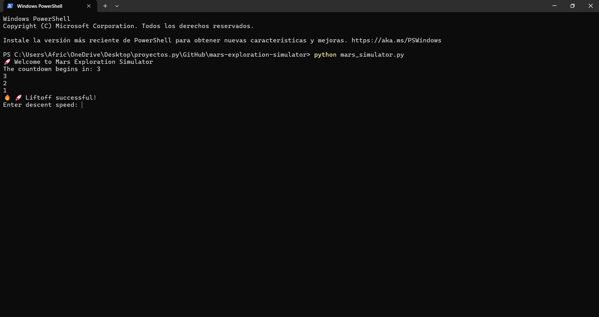

# 🚀 Mars Exploration Simulator
A simple interactive Mars mission simulator built in Python 🚀

## 📌 Requirements
- Python 3.x
- 
## 📸 Preview



Interactive console-based simulation built in Python where the user controls a space mission to Mars.

---

## 🌌 Features
- 🚀 Launch countdown system  
- 🛬 Safe landing with speed control  
- ⏳ Time-limited exploration mission  
- 🔧 Critical system repairs with sequence validation  
- 🌪️ Escape from a solar storm (mini-game)  

---

## 🧠 What I Learned
- Python while loops  
- Control flow and conditions  
- User input validation  
- Basic game logic design  
- Structuring code using functions  

---

## ▶️ How to Run

1. Make sure you have Python installed  
2. Download or clone this repository  
3. Run the script:

```bash
python mars_simulator.py
